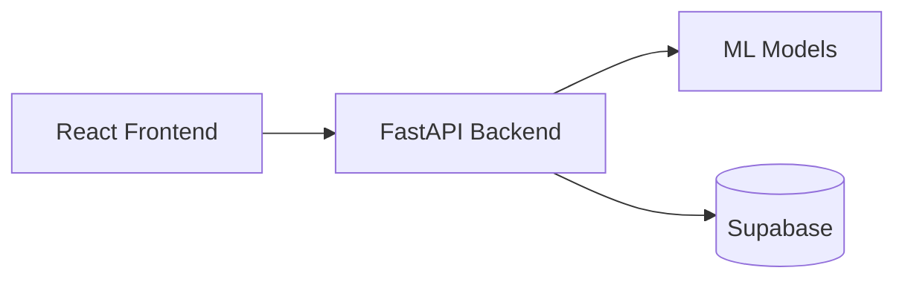

# Nebula X Hackathon

Team Name: dingdong

## Problem Statement 3: Predictive Fault Detection

Tasked to predict **four independent subsystems** of a rail vehicle and develop a user-friendly interface for engineers and operational users to interpret the results.

## Features

- Introduction page: briefly explains how to use the app and the 4 subsystems.
- Predict page: form-like uploads (drag-and-drop and multi-file supported) for each subsystem. Detailing what is required in the input files for each subsystem and form validation to ensure inputs match the requirements for each subsystem.
- History page: history of past records submitted along with navigation to dashboard pages.
- Dashboard page: for insights and interpretability of predictions for each subsystem.

## Tech Stack


We used React for our frontend, FastAPI for our backend, Supabase for record and file storage. Our app is deployed on Google Cloud Run and can be accessed through https://frontend-205373376635.us-central1.run.app/



## Model Performance

Models for the four PS3 subsystems (**Door, ACV, Rail corrugation, SHM**), produced by
OpenEvolve-style LLM evolutionary search (`openevolve==0.3.2` driven through
[openevolve-scientist](https://github.com/xs271828/openevolve-scientist), Codex CLI backend, `gpt-5.6-luna`) against a leak-proof evaluator. Two tracks per task:

* **classical** — CPU-only, runs in a network-less Docker sandbox (numpy / scikit-learn / scipy only).
* **deep** — GPU-only deep learning (PyTorch, frozen TimesFM3 backbone + trained head), each fit/predict executed on an NUS SoC SLURM GPU node.

> **Status: snapshot, runs still in progress.** The 0.99 target has **not** been met on the robust metrics for any task.
> Numbers below were taken 2026-09-19; re-generate with `scripts/collect_best.py`.

## Current best (official metric per task)

`combined = 0.5 · cv3 + 0.5 · train/test`. cv5 is reported but not part of the score.

| Task (metric) | Track | combined | 3-fold | 5-fold | train/test |
|---|---|---:|---:|---:|---:|
| **Door** (accuracy) | classical | **1.000** | 1.000 | 1.000 | 1.000 |
|  | deep | 0.994 | 0.989 | 1.000 | 1.000 |
| **ACV** (rank-decay) | classical (raw signals) | 0.948 | 0.896 | 0.900 | 1.000 |
|  | classical_nx † (per-signal ranker) | **0.964** | 0.927 | 0.912 | 1.000 |
|  | deep | 0.781 | 0.562 | 0.475 | 1.000 |
| **Rail** (macro-F1) | classical (raw) | 0.796 | 0.665 | 0.600 | 0.926 |
|  | classical_nx † | **0.861** | 0.877 | 0.871 | 0.845 |
|  | deep | 0.481 | 0.489 | 0.419 | 0.473 |
| **SHM** (1 − MAPE) | classical (raw) | 0.808 | 0.800 | 0.809 | 0.815 |
|  | classical_nx † | **0.940** | 0.939 | 0.935 | 0.941 |
|  | deep | 0.631 | 0.494 | 0.553 | 0.768 |

† `classical_nx` = Rail/SHM seeded from the independent `nebulax` pipeline and then evolved further — **optimistic**, see the caveat in the next section.

Classical leads deep on every task; the deep Door track (re-run on the corrected data) comes closest at 0.994 but does not beat the classical 1.000. The ACV `classical_nx` row is the per-signal pairwise ranker: it is perfect on every case that shares the deployment signal schema; its cv5 of 0.9125 is capped by train case 4, which exposes 32 signals no other case has (chance level there — no model can predict it from the others).

## Correction: Door data bug (found after the first release of this branch)

The original Door arrays (`data/ps3_prepare.py::door`) selected each segment with a custom timestamp-to-integer
conversion that mis-orders millisecond fields of different widths ("20" vs "700"). **0 of the 110 training segments had
the right length** (e.g. a 186-row cycle came out as 1,979 rows), so all earlier Door numbers — classical 0.976 and the
deep track — were measured on garbled slices. Rail, ACV and SHM read their files directly and are unaffected.

`data/build_door_fixed.py` slices each segment by the exact row indices of its `start_time`/`end_time`
(all 110 row counts equal the answer file's `n_rows`). On the corrected data the best classical Door program scores
**1.000 on 3-fold, 5-fold and train/test**, versus 0.727 for the majority baseline. The deep Door track was archived and
restarted on the corrected data; its numbers above are withheld until it has re-run. The `door/classical_top10` archive
and `door/checkpoints` were evolved on the wrong slices (the *best* program still scores 1.0 on the right ones).
Door test-stream segmentation (cut where the inter-row gap exceeds 1 s) reproduces all 110 training segments exactly
(`scripts/validate_transforms.py`).

### Rail and SHM, seeded from the independent `nebulax` pipeline (`classical_nx`)

An earlier, independent effort on this same benchmark (the `ian-classical` branch of this repository)
reports far better Rail and SHM numbers than the raw-input tracks above, so a third track was seeded with that
effort's promoted models and then handed to the same evolutionary search:

* **Rail** — three class-balanced logistic heads (v3 / relative / phase descriptors of all 128 sensor channels +
  tachometer) with fold-local `StandardScaler` + `SelectKBest`, a Side-I log-probability bias, and nested inner-CV
  selection of the phase branch (`rail/scripts/ps3_rail_nested_source_selection.py` in that branch).
* **SHM** — five-view kernel-ridge/SVR blend in log-target space over multiscale, generic, rainflow and temporal trace
  descriptors, followed by a clipped Ridge residual calibrator on log amplitude/roughness covariates
  (`shm/scripts/ps3_shm_nested_blend_probe.py`, `ps3_shm_residual_dynamics_probe.py`).

Their descriptors are label-free, deterministic per-recording transforms, so they are precomputed
(`data/build_nx_arrays.py`) and each example is one feature vector; the train/test split is the **same** as for the raw-input
tracks (row order is asserted equal to the original labels), so the numbers are directly comparable. Only two
output-neutral changes were made when porting: per-fold caching of the base/phase heads (speed), and a fixed
`random_state` for mutual-information feature selection (reproducibility).

**Caveat — these scores are optimistic.** That earlier work chose its features and hyperparameters using
cross-validation over *all* 272 Rail recordings / 64 SHM traces, which includes this repository's fixed test rows
and the CV folds' rows. So `train/test` and 3-/5-fold for `classical_nx` are not clean held-out estimates. Its own
contiguous-source-block OOD checks (Rail 0.917 BAcc, SHM 0.938 score) are the closest thing to independent evidence.

### Read these numbers with the data sizes in mind

| Task | train | test | notes |
|---|---:|---:|---|
| Door | 83 | 22 | 60 Normal / 23 Abnormal; test 16 / 6 |
| Rail | 217 | 55 | Normal 187 / Side II 19 / **Side I 11**; test 47 / 5 / **3** |
| ACV | 40 | 8 | 5 faulty in train, **1 faulty test case** → `train/test = 1.000` means one case ranked first |
| SHM | 51 | 13 | continuous target |

* The fixed train/test split is very noisy: one Door test sample ≈ 4.5 pts, one Rail Side-I sample swings macro-F1 by several points. **3-/5-fold CV is the more trustworthy signal**, and it is below 0.95 for ACV, Rail, SHM and every deep track; only Door classical reaches ≈ 0.95 (3-fold) / 0.94 (5-fold).
* Rail is limited by 11 Side-I training recordings; ACV by 5 independent faulty cases. Expect 0.99 to be unreachable there without more data.
* The evolutionary search selects on `combined`, which includes the fixed test split, so best-of-N selection bias applies to `train/test` and `combined`.

## Final submissions (two variants)

`submissions/no_hard_label_retraining/` and `submissions/with_hard_label_retraining/` each hold the four organiser CSVs,
`predictions.zip` (the four CSVs at the top level, nothing else), `final_predictions.csv` (all four tracks in one long file)
and `manifest.json`. Both were validated with `scripts/validate_submission.py` (exact columns, byte-identical headers to the
organiser examples, file ids / timestamps that match the held-out files) and are built by `scripts/build_two_submissions.py`.
No test labels exist locally, so every number below is a cross-validated estimate on the labelled data, not a held-out score.

**Every final model is fitted on ALL the labelled data** (Door 110 segments, ACV 48 cars, Rail 272 recordings, SHM 64 traces;
`manifest.json` records the row counts). Hold-out folds are used only to *choose* and *measure*.

| Task | Program used (all classical) | What it is | Out-of-fold evidence |
|---|---|---|---|
| Door | `classical:41962a` | scaled RBF-SVM on rich per-channel segment statistics | 1.000 (deep track's best: 0.994) |
| ACV | `classical_nx:seed` | pairwise faulty-vs-normal ranker on per-signal, case-centred car descriptors | rank 1 in all five cases sharing the deployment signal schema (1.000) vs 0.95 for the raw-signal programs |
| Rail | `classical_nx:68a6b9` | logistic heads over v3 / relative / phase descriptors of all 128 channels | macro-F1 0.852 (5-fold, all data) |
| SHM | `classical_nx:46efff` | log-target kernel/SVR blend + residual calibrator on trace descriptors | 0.924 (5-fold, all data) |

**Ensembling was tried and NOT used.** Rule: an ensemble is used only if its nested out-of-fold score (weights fitted on the other folds
only) is strictly higher than the best single program trained on all the data. It never was: Door and ACV tie at 1.000,
Rail 0.819 vs 0.836, SHM 0.924 vs 0.925 (`docs/evidence/decision_report_*.json`). Six fold-creation schemes were compared
(`scripts/compare_fold_schemes.py`, `docs/evidence/fold_scheme_comparison_*.json`): all data, diverse-normals thirds, overlapping 2/3,
cross-fit k-fold, bootstrap, 80% subsamples. The "all faulty + a different third of the normals" scheme was consistently the weakest
(SHM 0.909 vs 0.928 for the single program) because every member sees less data and a skewed class mix.

**Hard-label retraining (the "with" variant).** The programs return hard labels, so confidence is *member agreement*: 10
80%-subsample copies predict the held-out set, and an item's confidence is the fraction that agree with the main prediction (cutoff 0.9
= the "p ≥ 0.9 or ≤ 0.1" band; for SHM the cutoff is the fraction of most-consistent traces kept; for ACV, agreement on the
case's top-1 car). Only items at/above the cutoff are pseudo-labelled; the same program is retrained on all labelled data plus those
items and predicts the whole held-out set again. The cutoff was tuned on the labelled data with 3-fold CV (each fold plays the
unlabelled set; ACV: leave-one-case-out), scoring the pooled predictions against the hidden truth
(`scripts/tune_pseudolabel_cutoff.py`, `submissions/cutoff_3fold/pseudolabel_cutoff_tuning.json`):

| Task | Program | none | 0.0 | 0.6 | 0.7 | 0.8 | 0.9 | 1.0 | best |
|---|---|---:|---:|---:|---:|---:|---:|---:|---:|
| Door | `41962a` | 0.9818 | 0.9818 | 0.9909 | 1.0000 | 1.0000 | 1.0000 | 1.0000 | **1.0** |
| Rail | classical_nx:68a6b9 | 0.8518 | 0.8581 | 0.8637 | 0.8625 | 0.8345 | 0.8291 | 0.8568 | **0.6** |
| ACV | `nx:seed` | 1.0000 | 1.0000 | 1.0000 | – | 1.0000 | – | 1.0000 | 1.0 (all tie) |
| SHM (keep fraction: 1.0 / 0.75 / 0.5 / 0.25) | `46efff` | 0.9226 | 0.9272 | 0.9285 | 0.9297 | 0.9161 | – | – | **0.5** |

Read it with care: one seed, small folds, and the gains are within noise (Rail is non-monotonic — 0.8/0.9 are *worse* than not
retraining). On the real held-out sets the retraining changes very little: Door 0 of 38 labels, Rail 1 of 68 (`Test13.csv`
Normal→Side I), ACV top-1 car unchanged (two mid-ranked cars swap), SHM values move 2% on average (max 10%).

**ACV note.** The evolved raw-signal ACV programs collapse all signals per time step and cannot see *which* signal deviates; the
per-signal ranker can. Five train cases and the deployment case expose the same 4 signals; train case 4 exposes 32 different
ones, so it cannot be predicted from the rest (excluded from scoring and calibration, kept in training). The metric's tie handling
was also fixed (ties scored at expected rank) — previously an all-tied case got rank 1 whenever the faulty car was listed first.

## Earlier work (Phase 1: frozen TimesFM3 heads on the cluster)

Before the evolutionary search, a shared-head repurposing of frozen TimesFM3 was built and run on the cluster
(`phase1_timesfm/`, full write-up in `docs/phase1_progress.md`). Headlines:

* Frozen TimesFM3 + linear head, trained across 41 UCR datasets, best long-context variant averaged ≈ 0.807 on four held-out UCR datasets vs ≈ 0.822 for the FlaMinGo reference — **did not beat the reference**.
* PS3 with TimesFM heads alone was weak: Door 0.9375 BAcc, Rail 0.600, ACV 0.500, SHM 0.435 (score).
* Classical fixed-split baselines from that phase (balanced accuracy, not the official metrics): Door 0.9688, Rail 0.9262 (compact engineered SVC), ACV 1.0 (one test case), SHM 0.6061 (ExtraTrees).
* Its 3-/5-fold audit showed the fixed splits were optimistic (Door 0.85, Rail 0.62–0.68, ACV 0.47, SHM 0.70–0.71) — the same gap the evolved models show.
* Negative results worth not repeating: prototype heads, temporal-statistics heads, shared-attention (SDA) heads, TimesFM+raw fusion, Rail augmentation, and Rail ROCKET / XGBoost / KNN / PCA / stacking all failed to beat the compact SVC.

The evolved deep tracks here start from that idea (frozen TimesFM3 + gated-attention MIL head, `baseline_deep.py`) but are free to change the head, training loop and ensembling.

## Get started

**Frontend:**

```
cd app/frontend
npm run dev
```

**Backend:**

```
cd app/backend
source .venv/bin/activate
uvicorn main:app --reload --port 8000
```

Then open http://localhost:5173.

**Deployment:**

Run when there are updates to frontend:
```
cd app/frontend
gcloud run deploy frontend --source . --region us-central1 --allow-unauthenticated \
  --set-env-vars BACKEND_HOST=backend-7jonzrweja-uc.a.run.app
```

Run when there are updates to backend:
```
cd app/backend
gcloud run deploy backend --source .
```

## Contributors

| Name                        | GitHub Username   |
|-----------------------------|-------------------|
| Ian Buxton                  | [Buxt-Codes](https://github.com/Buxt-Codes)
| Rachel Tan                  | [Racheltmz](https://github.com/Racheltmz)
| Tan Yichen                  | [sultanyichen](https://github.com/sultanyichen)
