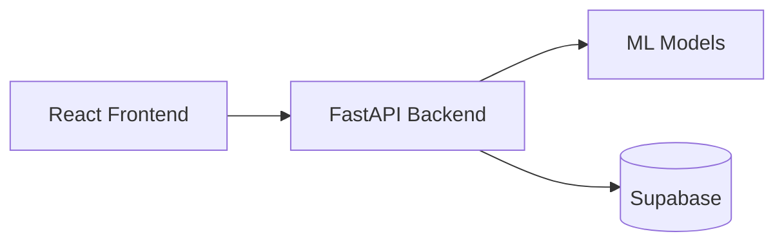

# Nebula X Hackathon

Team Name: dingdong

## Problem Statement 3: Predictive Fault Detection

Tasked to predict **four independent subsystems** of a rail vehicle and develop a user-friendly interface for engineers and operational users to interpret the results.

## Features

- Introduction page: briefly explains how to use the app and the 4 subsystems.
- Predict page: form-like uploads (drag-and-drop and multi-file supported) for each subsystem. Detailing what is required in the input files for each subsystem and form validation to ensure inputs match the requirements for each subsystem.
- History page: history of past records submitted along with navigation to dashboard pages.
- Dashboard page: for insights and interpretability of predictions for each subsystem.

## Tech Stack


We used React for our frontend, FastAPI for our backend, Supabase for record and file storage. Our app is deployed on Google Cloud Run and can be accessed through https://frontend-205373376635.us-central1.run.app/



## Models
We chose to tackle all four PS3 subtasks (**Door, ACV, Rail corrugation, SHM**) through a robust evolutionary search algorithm. We used an [AlphaEvolve](https://arxiv.org/pdf/2506.13131) inspired LLM algorithm against a rigorous evaluator. Given our limited 24 hours, we are proud to be able to diverge from traditional autoresearch pipelines with our evolutionary search implementation and to achieve the following official scores:

| Task             | Official Score |
|------------------|----------------|
| Door             | 0.947          |
| ACV              | 1.000          |
| Rail Corrugation | 0.808          |
| SHM              | 0.932          |

Below, we outline the approach taken for the development of models for each track as well as the outline of the model proposed per track.

## AlphaEvolve Search
### **1. Evaluation and Robustness**

We chose to tackle all four PS3 subtasks (**Door, ACV, Rail corrugation, SHM**) through a robust evolutionary search algorithm. We used an [AlphaEvolve](https://arxiv.org/pdf/2506.13131) inspired LLM algorithm against a rigorous evaluator. In order to ensure that we can run our algorithm unattended, our choice of an evaluation metric was paramount to ensure no cheating nor data leakages that could then hamper our performance in the unseen test set. We settled for the following evaluation metric:

* **3 Stratified Fold Cross Validation Result**: We would split the dataset into 3 class balanced folds and compute the average of the model's performance when trained over 2 folds and tested over 1 fold for every possible permutation of it. This allows us to test how well the model would possibly perform on out of fold data, giving us a robust estimate of how well it would perform on the hidden test set.
* **Train / Test (0.8 / 0.2) Result**: We would split the dataset into 80% for training and 20% for testing whilst maintaining class balance. This larger split's results allow us to see how well our model would perform with more data given that in the 3 Fold CV test, it may underperform due to the scarce lack of data such as the availability of only 1 example for a type of fault.

Taking the average of these two metrics, we are able to have a robust evaluation metric. Furthermore, in order to ensure that our LLM would not cheat nor attempt to use test data to artificially inflate its scores, the LLM is run in an isolated environment and its script has no access to the internet and only exposes two methods .fit() and .predict() which accepts the raw data. Thus through this we managed to attain a rigorous evaluation protocol and a search algorithm in which we can leave unattended. 

### **2. Performance**

We spawned 8 tracks, 2 per subtask, to generate algorithms with two types of proposals - classical machine learning and deep learning. We split the subtasks into two tracks so that each focuses on a type of machine learning domain and as although classical machine learning would be more appropriate with its generalisation with scarce data, we hoped to test whether the representations of foundational time series models could be used as a few shot mechanism. The results are as follows:

| Task (metric) | Track | combined | 3-fold | 5-fold | train/test |
|---|---|---:|---:|---:|---:|
| **Door** (accuracy) | classical | **1.000** | **1.000** | **1.000** | **1.000** |
|  | deep | 0.994 | 0.989 | **1.000** | **1.000** |
| **ACV** (rank-decay) | classical | **0.964** | **0.927** | **0.912** | **1.000** |
|  | deep | 0.781 | 0.562 | 0.475 | **1.000** |
| **Rail** (macro-F1) | classical | **0.861** | **0.877** | **0.871** | **0.845** |
|  | deep | 0.481 | 0.489 | 0.419 | 0.473 |
| **SHM** (1 − MAPE) | classical | **0.940** | **0.939** | **0.935** | **0.941** |
|  | deep | 0.631 | 0.494 | 0.553 | 0.768 |

> We report 5 Fold Stratified Cross Validation results as well although they are not taken into account for the combined score which is computed via `combined = 0.5 · cv3 + 0.5 · train/test`

As seen above, classical methods leads deep on every task. This is expected given the lack of data for generalisation for the deep learning models. Deep learning performs worst in **Rail** which is expected given 128 channels and insufficient data and labels to train a robust model.

## **Door**
**Task:** Find every door open/close cycle in a continuous stream and thereafter label it as `Normal` or `Abnormal resistance`  
**Official Metric:** IoU-weighted F1 of predicted vs true segments (timing and label)  
**Public-Test Score:** **0.9474**  
**Cross-Validated Score:** 1.000 (3-fold, 5-fold, train/test, and all-data 5-fold)  
**Model:** Scaled RBF-SVM on 679 hand-built per-segment statistics  
**Evolution Details:** 610 search iterations

### **1. Preprocessing**

* **Channels** are converted numeric and missing values are zeroed.
* **Training Segments** are sliced by the *exact row indices* of each answer row's `start_time` / `end_time`
* **Test Segmentation** is performed whenever the time between consecutive rows exceeds 1 second as cycles are separated by idle gaps.

### **2. Model**

We use Scaled RBF-SVM with class balancing weights over the following features per segment:

* **Per channel (35 values):** Mean, std, min, max, range; 10/25/50/75/90th percentiles; mean |first difference|, mean square,
  linear slope, mean absolute deviation, first and last value, std of the difference, five percentiles of the difference, lag-1
  autocorrelation, four sub-segment means, and an 8-point resampled shape.
* **Shape profile:** Every channel z-normalised and resampled to 16 points, then the mean and std across channels at each point.
* **Cross-channel profiles:** At each time step the mean, std, range, median, quartiles and difference-statistics across the 16
  channels, each resampled to 8 points, plus the step-to-step change and the low-frequency spectrum of the cross-channel mean.

These handcrafted features are used as An abnormal cycle (door jamming, deformed leaf, sticking strip) shows up as a different *shape and level* of motor current / voltage / position over the cycle, not as a single-row spike. Thus summaries over the whole segment are able to capture those changes in shapes and levels. An RBF-SVM then easily separates the two clusters of `Normal` or `Abnormal resistance` with very little data.


## **ACV**
**Task:** Rank the cars from most to least likely faulty with a refrigerant leak  
**Official Metric:** Rank-decay: `(8 − (rank − 1)) / 8` for the true faulty car  
**Public-Test Score:** **1.000**  
**Cross-Validated Score:** 1.000  
**Model:** Pairwise faulty-vs-normal Logistic Ranker  
**Evolution Details:** 600 search iterations 

### **1. Preprocessing**

* **Case Centering** is where we subtract for each feature, the median over the 8 cars of the same case. Only "which car deviates from its siblings" remains, so case-wide offsets (weather, route, train) drop out.
* **Union the Columns** over all cases (148) where a signal a case does not have becomes `NaN`.
* **Car Vectorisation** of features into 148-vectors. In total, all 48 cars are used.

### **2. Model**

We use a Pairwise Faulty-vs-Normal Logistic Ranker with standard scaling and feature selection over the following features per car:

* **Per signal (4 values):** Mean, standard deviation, missing-value fraction, and last-minus-first change of the valid readings.
* **Case-relative features:** Every feature is centred by subtracting the median value across the 8 cars within the same case, so each value represents how strongly a car deviates from its siblings rather than its absolute signal level.
* **Pairwise differences:** Every faulty car is compared against every normal car by taking `faulty − normal` feature vectors in both directions. This converts the 6 faulty cars into 252 faulty-vs-normal comparisons (504 including both signs).
* **Feature selection and ranking:** The pairwise vectors are standardised before `SelectKBest(f_classif, k=5)` selects the five most discriminative features. Logistic Regression with `C=0.003` and balanced class weights is then trained on these differences. At inference, its decision function provides each car's fault score and the 8 cars are ranked from highest to lowest.

These pairwise features are used as a refrigerant leak should cause the faulty car to behave differently from the other cars operating under the same case conditions, rather than exhibit the same absolute signal pattern across every case. Thus centering each car against its siblings removes case-wide effects such as weather, route and train conditions, while pairwise training directly learns which deviations distinguish a faulty car from a normal one. A Logistic Ranker then uses these differences to assign each car a fault score and directly rank the most likely faulty car first.


## **Rail**
**Task:** Classify each 1-second, 128-channel axle-box recording as `Normal`, `Side I` or `Side II` corrugation  
**Official Metric:** Macro-F1 over the three classes  
**Public-Test Score:** **0.8080**  
**Cross-Validated Score:** 0.852 (5-fold); 0.857 combined  
**Model:** Ensemble of regularised classifiers over vibration, side-difference and wheel-phase features  
**Evolution Details:** 100 search iterations  

### **1. Preprocessing**

* **Signal Features** summarise each recording using statistics such as RMS, percentiles, kurtosis, skewness and frequency-band energy across the vibration and shock sensors.
* **Side Differences** compare corresponding features from Side I and Side II. This removes overall train vibration and highlights which side behaves abnormally.
* **Wheel-Phase Features** use the tachometer to align vibration with wheel rotation, allowing periodic corrugation patterns to be captured.

### **2. Model**

We use an ensemble of regularised classifiers over the following feature views:

* **Signal views:** Logistic Regression models are trained on the signal and side-difference features, with feature selection used to retain only the most useful features.
* **Retrieval view:** The five most similar training recordings provide distance-weighted class predictions.
* **Hierarchical view:** One classifier first detects whether a fault exists, while another determines whether it is on `Side I` or `Side II`.
* **RBF-SVM view:** An RBF-SVM provides an additional nonlinear prediction from the side-difference features.
* **Phase view:** A Logistic Regression model uses the wheel-phase features to detect vibration patterns associated with wheel rotation.

The predictions from these models are combined using weighted probabilities. Cross-validation then selects the final decision biases for `Side I` and `Side II` to maximise macro-F1.

These features are used as rail corrugation should produce a different vibration pattern on the affected side and a repeating response linked to wheel rotation. Thus side-difference features identify which rail behaves abnormally, while wheel-phase features capture periodic corrugation patterns. Combining several regularised models allows these complementary signals to be used while reducing overfitting on the small number of faulty recordings.


## **SHM**
**Task:** Predict one cumulative-damage value for each dynamic-stress trace  
**Official Metric:** `max(0, 1 − MAPE)`  
**Public-Test Score:** **0.9322**  
**Cross-Validated Score:** 0.924 (5-fold); 0.940 combined  
**Model:** Blend of kernel, SVR and Ridge models over multiscale, rainflow and temporal stress features  
**Evolution Details:** 160 search iterations 

### **1. Preprocessing**

* **Multiscale Features** divide each stress trace into windows of different sizes and summarise its amplitude, variation and roughness using statistics such as RMS, peak-to-peak range, quantiles and slopes.
* **Rainflow Features** perform cycle counting at several downsampling levels and extract cycle ranges together with Miner-style damage sums. These directly describe the repeated stress cycles that contribute to cumulative damage.
* **Temporal Features** divide the trace into 128 windows and measure how its amplitude and variation change from the beginning to the end of the recording.
* **Generic Features** capture overall statistics, turning-point ranges and frequency information for the complete stress trace.

### **2. Model**

We use a blend of regularised regression models over the following feature views:

* **Multiscale views:** Two RBF Kernel Ridge models use selected multiscale features to predict damage from stress patterns at different time scales.
* **Generic and rainflow views:** Kernel Ridge models use global stress statistics and rainflow cycle features, including the Miner-style damage estimates.
* **Temporal view:** An SVR uses selected temporal features to capture how loading changes throughout the trace.
* **Linear view:** A strongly regularised Ridge model provides an additional prediction using selected generic, rainflow and temporal features.
* **Residual correction:** A Ridge model learns from out-of-fold prediction errors to correct systematic over- or under-prediction of damage.

All models predict `log(damage + offset)` rather than damage directly and give greater weight to low-damage traces. Their predictions are then blended before the residual correction is applied.

These features are used as cumulative damage depends on both the size and repetition of stress cycles rather than individual stress measurements. Thus rainflow features directly capture the cycles used to calculate damage, while multiscale and temporal features describe their strength and how loading changes throughout the trace. Combining several regularised models allows these complementary patterns to be used while reducing overfitting on the small number of training traces.

## Get started

**Frontend:**

```
cd app/frontend
npm run dev
```

**Backend:**

```
cd app/backend
source .venv/bin/activate
uvicorn main:app --reload --port 8000
```

Then open http://localhost:5173.

**Deployment:**

Run when there are updates to frontend:
```
cd app/frontend
gcloud run deploy frontend --source . --region us-central1 --allow-unauthenticated \
  --set-env-vars BACKEND_HOST=backend-7jonzrweja-uc.a.run.app
```

Run when there are updates to backend:
```
cd app/backend
gcloud run deploy backend --source .
```

## Contributors

| Name                        | GitHub Username   |
|-----------------------------|-------------------|
| Ian Buxton                  | [Buxt-Codes](https://github.com/Buxt-Codes)
| Rachel Tan                  | [Racheltmz](https://github.com/Racheltmz)
| Tan Yichen                  | [sultanyichen](https://github.com/sultanyichen)
